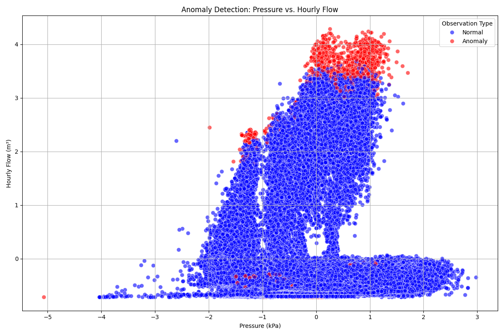
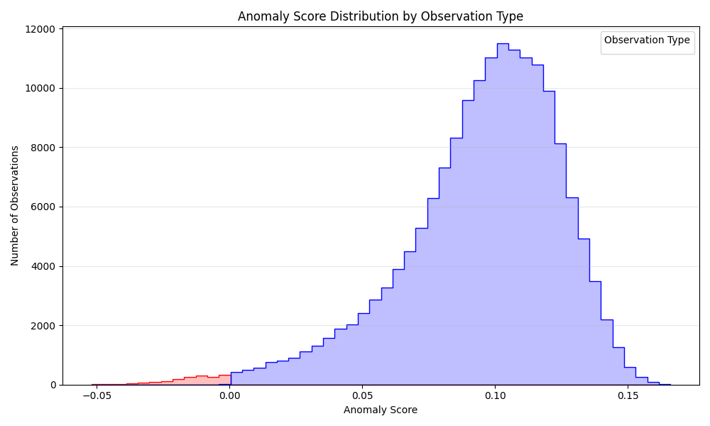
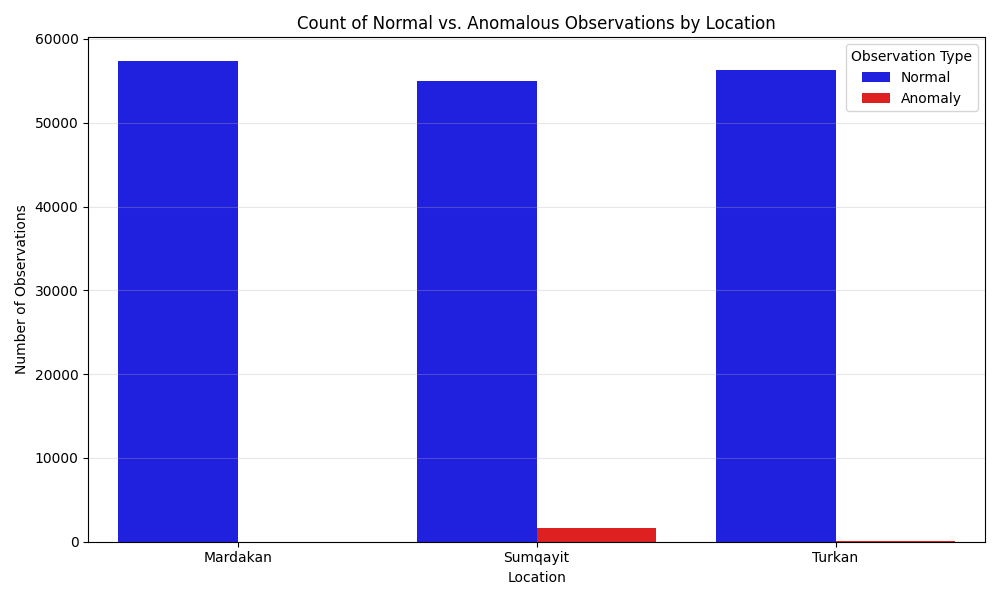
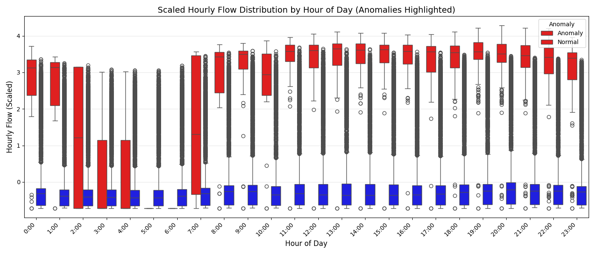
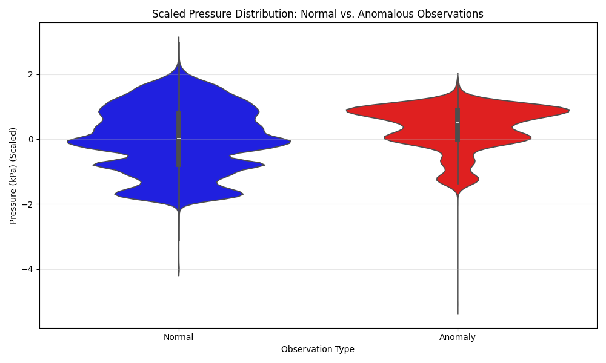
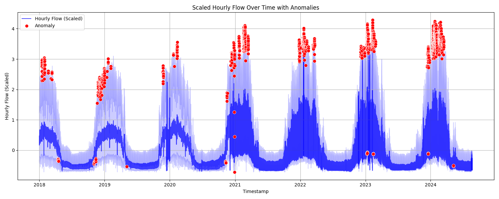

# 🔍 Anomaly Detection in Gas Pipeline Operations

A machine-learning–driven analytical solution for detecting abnormal operating conditions in natural gas pipeline sensor data collected from three monitoring stations in Azerbaijan: **Mardakan**, **Sumqayit**, and **Turkan**.

This project focuses on **early risk detection**, **operational stability**, and **preventive maintenance support** through data-driven anomaly identification.

---

## 📊 Project Overview

The system applies an **Isolation Forest** model to identify rare and unusual sensor patterns that may indicate:

* Pipeline leaks
* Equipment degradation
* Sensor malfunction
* Abnormal demand or pressure behavior

| Metric                   | Value                           |
| ------------------------ | ------------------------------- |
| **Total Observations**   | ~174,000 hourly records         |
| **Time Coverage**        | 2018 onward                     |
| **Monitoring Locations** | 3                               |
| **Target Anomaly Rate**  | ~1% (model contamination)       |
| **Model Type**           | Isolation Forest (unsupervised) |

---

## 🔬 Data Characteristics

Each observation represents an **hourly operational snapshot** of the gas pipeline.

| Feature             | Description                | Unit  |
| ------------------- | -------------------------- | ----- |
| `density_kg_m3`     | Gas specific gravity       | kg/m³ |
| `pressure_diff_kpa` | Pressure differential      | kPa   |
| `pressure_kpa`      | Absolute pipeline pressure | kPa   |
| `temperature_c`     | Gas temperature            | °C    |
| `hourly_flow_m3`    | Hourly gas flow rate       | m³    |
| `total_flow_m3`     | Cumulative gas volume      | m³    |

All features are **scaled and standardized** prior to modeling to ensure balanced anomaly detection.

---

## 📈 Analysis Results & Business Insights

### 1. Pressure vs. Hourly Flow (Anomaly Landscape)

This scatter plot visualizes the relationship between **pressure** and **hourly flow**, highlighting anomalous observations.



**Insights:**

* Normal operating conditions form a **dense central cluster**
* Anomalies occur at **extreme combinations** of pressure and flow
* Both unusually **high-pressure/high-flow** and **low-pressure/low-flow** states are flagged
* Confirms pressure–flow coupling as a critical operational indicator

---

### 2. Anomaly Score Distribution

This histogram shows the distribution of **Isolation Forest anomaly scores**.



**Insights:**

* The majority of observations lie within a **stable, normal range**
* A small tail of low-score observations represents **high-risk behavior**
* Clear separation supports the chosen anomaly threshold
* Confirms model selectivity and low false-positive risk

---

### 3. Anomaly Frequency by Location

This chart compares anomaly counts across monitoring stations.



**Insights:**

* All locations exhibit a **similar anomaly proportion**
* **Sumqayit** shows a slightly higher absolute anomaly count
* Suggests model generalizes well across locations
* Enables location-specific inspection prioritization

---

### 4. Hourly Flow Behavior by Time of Day

This visualization highlights **daily operational patterns** and anomalies.



**Insights:**

* Higher variability during **peak demand hours (08:00–22:00)**
* Night hours show **stable and predictable flow**
* Anomalies occur at all times but intensify during high-load periods
* Supports demand-driven stress hypothesis

---

### 5. Pressure Distribution: Normal vs. Anomalous

This violin plot compares pressure behavior between normal and anomalous observations.



**Insights:**

* Normal pressure readings are tightly distributed
* Anomalies show **wide dispersion and extreme values**
* Confirms pressure as a dominant anomaly driver
* Useful for defining operational pressure limits

---

### 6. Time-Series View: Hourly Flow with Anomalies

This time-series chart overlays detected anomalies on the hourly flow signal.



**Insights:**

* Anomalies appear as **sharp deviations** from normal trends
* Clusters of anomalies indicate **potential systemic events**
* Enables root-cause analysis by correlating with maintenance or incidents
* Highly actionable for operational monitoring and alerting

---

## 🛠️ Technical Architecture (High-Level)

```
┌─────────────┐    ┌──────────────┐    ┌─────────────┐    ┌────────────┐
│ Raw Sensor  │───▶│ Preprocessing│───▶│ Feature     │───▶│ Isolation  │
│ Data (CSV)  │    │ & Scaling    │    │ Engineering │    │ Forest     │
└─────────────┘    └──────────────┘    └─────────────┘    └────────────┘
                                                                │
                   ┌──────────────┐    ┌─────────────┐         ▼
                   │ Persisted    │◀───│ Anomaly     │◀────────┘
                   │ Model        │    │ Scoring     │
                   └──────────────┘    └─────────────┘
```

---

## 🚀 Model Usage Example

```python
import joblib
import pandas as pd

model = joblib.load('models/isolation_forest_model.joblib')

sample = pd.DataFrame({
    'density_kg_m3': [0.75],
    'pressure_diff_kpa': [5.0],
    'pressure_kpa': [600.0],
    'temperature_c': [12.0],
    'hourly_flow_m3': [5.0],
    'total_flow_m3': [120.0]
})

prediction = model.predict(sample)
# -1 → Anomaly | 1 → Normal
```

---

## 📁 Project Structure

```
anomalies_in_gas_pipeline/
├── README.md
├── charts/
│   ├── anomaly_detection.png
│   ├── anomaly_score_distribution.png
│   ├── anomalies_by_location.png
│   ├── hourly_flow_by_hour_anomalies.png
│   ├── hourly_flow_anomalies_timeseries.png
│   └── pressure_distribution_anomalies.png
├── data/
│   ├── Mardakan.csv
│   ├── Sumqayit.csv
│   └── Turkan.csv
├── models/
│   └── isolation_forest_model.joblib
└── notebooks/
    └── analyse.ipynb
```

---

## 📌 Key Conclusions

1. **Reliable Detection**: The model consistently identifies rare abnormal states
2. **Pressure Sensitivity**: Pressure is the strongest anomaly indicator
3. **Temporal Risk**: Peak demand hours increase anomaly likelihood
4. **Spatial Consistency**: Similar behavior across locations validates robustness
5. **Operational Value**: Results directly support preventive maintenance planning

---

## 📄 License

MIT License — Free to use, adapt, and extend for industrial monitoring and analytics.

---

*Built with Python • Isolation Forest • Industrial Sensor Analytics*
